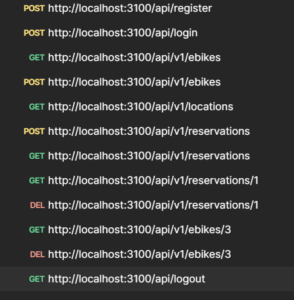

<a name="readme-top"></a>

<div align="center">

  <h1><b>Ebike Reservation BackEnd</b></h1>

</div>

<!-- TABLE OF CONTENTS -->

## 📗 Table of Contents

- [📖 About ](#about-project)
  - [🛠 Built With ](#built-with)
    - [Tech Stack ](#tech-stack)
    - [Key Features ](#key-features)
  <!-- - [Live Demo](#live-demo) -->
  - [💻 Getting Started ](#getting-started)
    - [Prerequisites](#prerequisites)
    - [Setup](#setup)
    - [Install](#install)
    - [Usage](#usage)
  - [👥 Authors ](#authors)
  - [🔭 Future Features ](#future-features)
  - [🤝 Contributing ](#contributing)
  - [⭐️ Show your support ](#️show-your-support)
  - [🙏 Acknowledgments ](#acknowledgments)
  - [📝 License ](#license)

<!-- PROJECT DESCRIPTION -->

# 📖 About <a name="about-project"></a>

**Ebike Reservation BackEnd** is a responsive application to reserve a test riding an electric bike.

## 🛠 Built With <a name="built-with"></a>

### Tech Stack <a name="tech-stack"></a>

<details>
  <summary>Server</summary>
    <li><a href="">Ruby</a></li>
    <li><a href="">Rails</a></li>
</details>

<!-- Features -->

### Key Features <a name="key-features"></a>

- **Authentication**
- **Authorization**
- **API**
- **Figma Design**

<p align="right">(<a href="#readme-top">back to top</a>)</p>

<!-- 
## 🚀 Live Demo <a name="live-demo"></a>
- [Live Demo](https://www.loom.com/share/251368f90b724dcaaae58936fd4fd53a?sid=b14a6a4a-e243-4d1a-bc73-fa376a101421)

- [Deployment](https://snapscan-khanh.onrender.com) -->

<p align="right">(<a href="#readme-top">back to top</a>)</p>

<!-- GETTING STARTED -->

## 💻 Getting Started <a name="getting-started"></a>

To get a local copy up and running, follow these steps.

### Prerequisites

In order to run this project you need:

```
    ruby
    bundler
```

### Setup

Clone this repository to your desired folder:

```bash
  git clone https://github.com/khanh-devos/rails-7-snapscan.git 
```

### API DOCUMENTATION

[API DOCUMENTATION](https://documenter.getpostman.com/view/25150116/2s9YXk2LKW)



### Install

Install this project with:

```bash
  cd the_new_folder_name
  bundle install
```

it will install the required gemfile for running the project

### Usage

```bash
  rails s
```


<p align="right">(<a href="#readme-top">back to top</a>)</p>

<!-- AUTHORS -->

## 👥 Author <a name="authors"></a>

👤 **Khanh-Devos**

- GitHub: [@khanh-devos](https://github.com/khanh-devos)
- Twitter: [@khanhror](https://twitter.com/khanhror)
- LinkedIn: [LinkedIn](https://www.linkedin.com/in/khanh-dom/)

👤 **Souad El Mansouri**

- GitHub: [@souad988](https://github.com/khanh-devos)
- Twitter: [@souadElmansouri](https://twitter.com/souadElmansouri)
- LinkedIn: [LinkedIn](https://www.linkedin.com/in/souad-el-mansouri/)

👤 **Rodrigo Penayo**

- GitHub: [@rodrigopenayo98](https://github.com/rodrigopenayo98)
- Twitter: [@rodrigopenayo98](https://twitter.com/rodrigopenayo98)
- LinkedIn: [LinkedIn](https://www.linkedin.com/in/rodrigopenayo/)


👤 **Tchasinga Jacques**

- GitHub: [@stchasinga](https://github.com/tchasinga)
- Twitter: [@Tchasinga](https://twitter.com/Tchasinga)
- LinkedIn: [LinkedIn](https://www.linkedin.com/in/tchasinga-jacques-76aba7214/)

<!-- FUTURE FEATURES -->

## 🔭 Future Features <a name="future-features"></a>

- **More features**
- **Animation**

<p align="right">(<a href="#readme-top">back to top</a>)</p>

<!-- CONTRIBUTING -->

## 🤝 Contributing <a name="contributing"></a>

Contributions, issues, and feature requests are welcome!

Feel free to check the [issues page](https://github.com/khanh-devos/snapscan/issues).

<p align="right">(<a href="#readme-top">back to top</a>)</p>

<!-- SUPPORT -->

## ⭐️ Show your support <a name="support"></a>

If you like this project you can share this project to your friend

<p align="right">(<a href="#readme-top">back to top</a>)</p>

<!-- ACKNOWLEDGEMENTS -->

## 🙏 Acknowledgments <a name="acknowledgements"></a>

I would like to thank [Murat Korkmaz](https://www.behance.net/muratk)  for his [beautiful design](https://www.behance.net/gallery/26425031/Vespa-Responsive-Redesign) and all the contributors for this project

<p align="right">(<a href="#readme-top">back to top</a>)</p>

<!-- LICENSE -->

## 📝 License <a name="license"></a>

This project is [MIT](./LICENSE) licensed.

<p align="right">(<a href="#readme-top">back to top</a>)</p>
